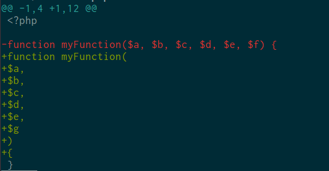
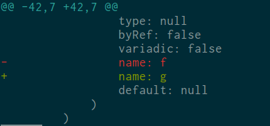

# git php diff

Display the git diff of your PHP files using an AST.

## Example

If you have have some PHP code like this: 

```php
<?php
function myFunction($a, $b, $c, $d, $e, $f) {
}
```

and if you change it to be like this (you rename a parameter and pass the parameters on multiple lines):

```php
<?php

function myFunction(
$a,
$b,
$c,
$d,
$e,
$g
)
{
}
```

The `git diff` command will output something like this (the rename of parameter will not be easily visible because of the others parameters are now on another line) :



Now with git php diff, when you launch the `git php-diff` command, the ouput will look like this:



You will only see the changes that have a real impact on your code by making the diff on an AST.

## Installation

Download the phar :

```bash
wget https://github.com/agallou/git-php-diff/releases/download/v0.0.1/git-php-diff.phar
```

Rename and put it on a folder that is on your `PATH`.

```bash
mv git-php-diff.phar ~/bin/git-php-diff
```

## Usage

Just run the command `git php-diff`.

## Licence

git php diff is released under the MIT License. See the bundled LICENSE file for details.
